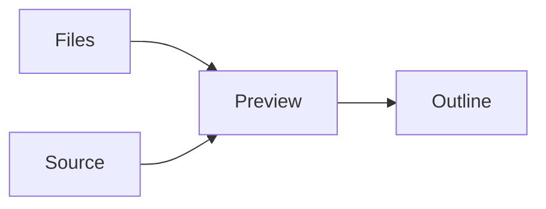

# Writing in markdown-kb

markdown-kb is a reading surface for notes kept as Markdown. The source stays exact. Preview is a view of that source.

> [!NOTE]
> An edit is a draft in this browser. It stays on this machine. Reset, in the top bar, shows the repository copy again.

## Measure

Prose sits in a column about sixty-six characters wide, with room between lines. On a narrow screen the line shortens instead of the type shrinking. Headings stay quiet. The outline on the right follows the page while there is room for it.

A useful line is long enough to hold a thought and short enough to find the next one.

## Lists

What the preview renders:

- Headings, emphasis, links, and images
- Tables, task lists, and footnotes
- Code, math, diagrams, and charts

- [x] Read the page before editing it
- [ ] Press `E` to edit the page as blocks

## Tables

| Pane | What it is for |
| --- | --- |
| Files | Jump between pages |
| Preview | Read |
| Editing | Write in blocks |
| Outline | Move through the page |

## Callouts

> [!TIP]
> Press `⌘K` to jump to a page. Press `E` to edit the page as blocks, and `⌘/` to see its Markdown source. Preview is the view you start in.

> [!IMPORTANT]
> The Markdown file is the document. Preview is a view of it.

> [!WARNING]
> A local draft overrides the repository copy until you reset it.

> [!CAUTION]
> A diagram or chart with a syntax error shows the message beside the block. The rest of the page still reads.

## Code

```ts
export const reading = {
  measure: "66ch",
  lineHeight: 1.7,
  fontSize: 17,
};
```

## Math

The reading measure stays near sixty-six characters.

$$
42 \le \text{characters per line} \le 75
$$

## Diagrams



## Charts

Charts are [Vega-Lite](https://vega.github.io/vega-lite/) specs in a `chart` fence. The numbers below are an example of the syntax.

```chart
title: Example word counts
width: container
height: 260
data:
  values:
    - { section: Measure, words: 80 }
    - { section: Tables, words: 40 }
    - { section: Diagrams, words: 25 }
    - { section: Charts, words: 30 }
mark: { type: bar, cornerRadiusEnd: 2 }
encoding:
  x: { field: section, type: nominal, axis: { title: null, labelAngle: 0 } }
  y: { field: words, type: quantitative, axis: { title: null } }
```

## A table from CSV

```csv
pane,job
Files,Jump between pages
Preview,Read
Editing,Write in blocks
Outline,Move through the page
```

## Links and notes

See the [[shortcuts]] for every key, or the [[layout]] of the screen. The keyboard section is included below.

![[shortcuts#Keyboard]]

Drafts never leave the browser.[^1]

[^1]: Reset drops the draft and shows the file from the repository again.

==Highlight== marks a phrase you want to find again. ~~Strikethrough~~ marks something you replaced. Press <kbd>⌘</kbd> <kbd>K</kbd> from anywhere.

<details>
<summary>Why the source stays plain</summary>

A diff is easier to trust when the editor does not rewrite the file. Preview can be careful because the source is allowed to stay ordinary Markdown.
</details>
